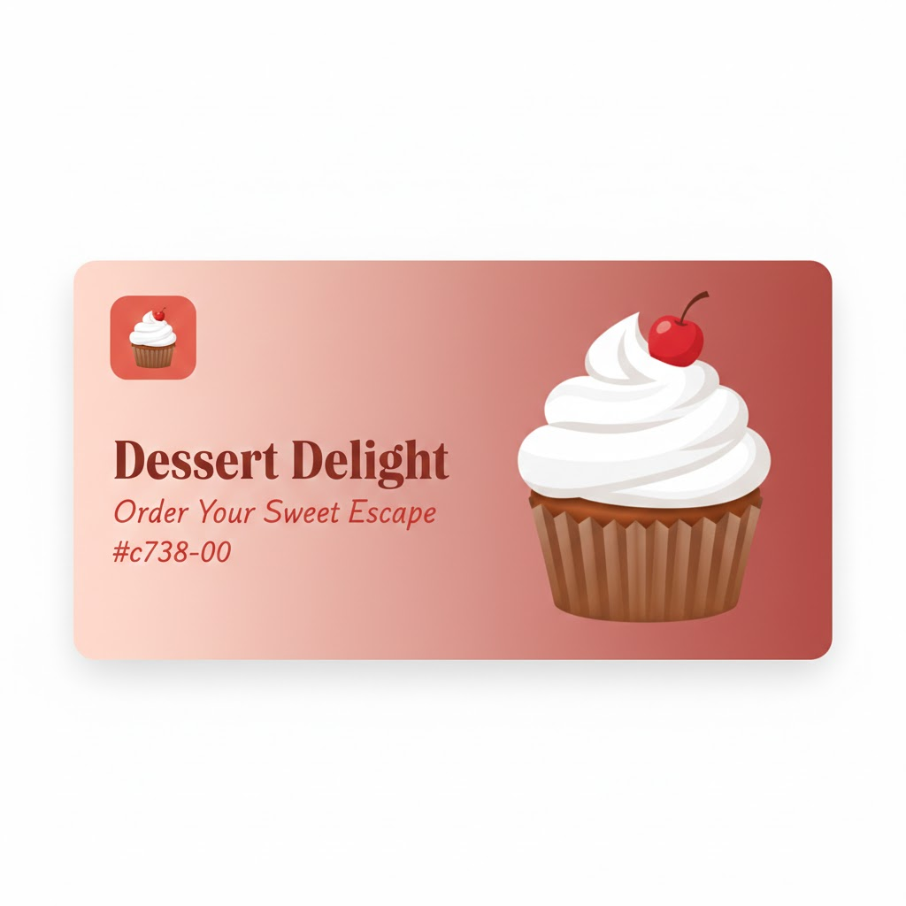

# 🧁 Dessert Delight | Product List with Cart

A modern, high-performance dessert ordering landing page built with a focus on clean UI and smooth user experience. This project demonstrates dynamic DOM manipulation, state management, and responsive design.



## 🚀 Live Demo

**Link:** https://dessert-delight-one.vercel.app/

---

## ✨ Key Features

- **Dynamic Product Rendering**: Products are fetched and rendered dynamically from a JSON data source.
- **Real-time Shopping Cart**:
  - Add/Remove items seamlessly.
  - Interactive quantity selector (Plus/Minus buttons) directly on the product card.
  - Automatic calculation of item subtotals and order grand total.
- **Responsive Layout**: Fully optimized for Mobile, Tablet, and Desktop using CSS Grid and Flexbox.
- **Order Confirmation**: A clean modal summary appears upon order completion with an option to reset the cart.
- **Persistence**: Cart data is saved to `localStorage`, so your items stay in the cart even after a page refresh.
- **SEO & Social Optimized**: Includes Meta tags for SEO and Open Graph tags for beautiful social media sharing.

---

## 🛠️ Tech Stack

- **HTML5**: Semantic structure for better accessibility and SEO.
- **CSS3**: Custom properties (CSS Variables), Grid, and Flexbox for layout.
- **JavaScript (ES6+)**: Functional programming approaches (map, reduce, filter) and JS Modules.
- **Font Awesome**: Professional iconography.
- **Google Fonts**: "Red Hat Text" for modern typography.

---

## 📂 Project Structure

```text
├── assets/
│   ├── css/
│   │   └── style.css          # Modern UI Styles
│   ├── image/                 # Favicons, Thumbnail, and Product images
│   └── js/
│       ├── app.js             # Main Logic & DOM Operations
│       └── data.js            # Product Data Source
├── index.html                 # Main Entry Point
├── site.webmanifest           # PWA / Mobile App Settings
└── README.md                  # Documentation
```

---

## 🎨 UI & Design Tokens

This project uses a custom color palette defined in CSS variables for easy maintenance:

- **Red** (Primary): #c73b0f

- **Green** (Success): #1ea94c

- **Rose** (Neutrals): From #fcf8f6 (light) to #260f08 (dark)

---

## 🔧 Installation & Local Setup

1. Clone the repository

```bash
git clone https://github.com/YOUR_USERNAME/php_user_login_system.git
```
2. Open with a Local Server: Since this project uses JavaScript Modules, you must run it through a server (like VS Code's "Live Server" extension) to avoid CORS policy restrictions.

---

## 📝 SEO Setup

To ensure the best ranking and visibility:

- The page includes a unique title and meta description.

- Images use descriptive alt tags.

- Favicons are provided for all devices (Apple, Android, and Browser).
